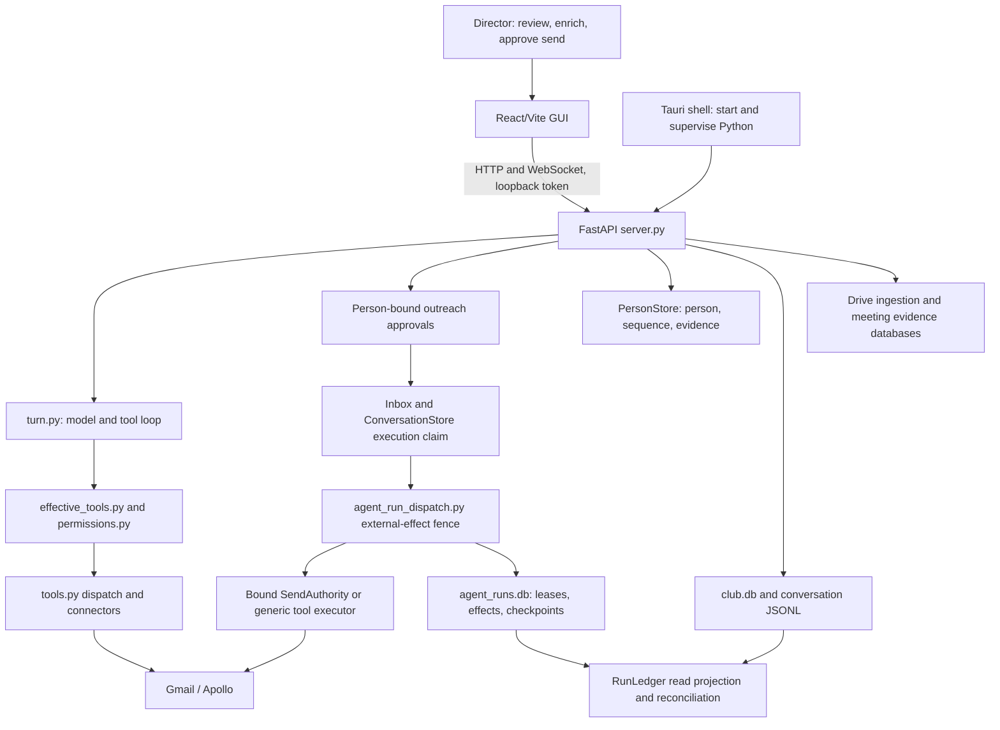

# Sourcecado architecture review for teammate onboarding

Date: 2026-09-21. Reviewed source: `614431aef8ec139751ed85b211d7eae31358f708` (`origin/main`, before onboarding changes). Issue states were read from GitHub on this date. This report proposes backlog dispositions; it does not change those issues.

Sourcecado's local Python backend, React GUI, and thin Tauri shell fit the current product: one director, one machine, durable person files. Preserve that shape. The highest-value work is to make reviewed send/enrichment authority consistent across entry points and finish the already-designed restart workflow. Module size and multiple SQLite files do not, by themselves, justify restructuring.

## System and dependency map



The generic tool path also goes through the turn's approval/fence machinery; the diagram separates dependencies, not bypass permissions. API composition is in `desktop/coworker/server.py:384`; startup constructs stores at `:420`, registers the run owner and recovery pass at `:457`, and includes the ledger router at `:470`. The ledger is a projection over existing stores, not a sixth SQLite database. Native development and packaged backend commands are in `desktop/surfaces/gui/src-tauri/src/lib.rs:50` and `:64`. Loopback binding is enforced in `desktop/coworker/run.py:83`.

For a first change, follow the job through the relevant route, domain operation, store, and existing test. Do not begin in `archive/hosted-web/`. Read the current product spec first, then `desktop/docs/approved-send.md` and `desktop/docs/agent-runs.md` before touching approvals or recovery. “Contacts” means active sequences; the internal Board projection also contains kept people before outreach. Five database owners remain distinct: ConversationStore, PersonStore, AgentRunRepository, DriveIngestionStore, and MeetingEvidenceStore.

## Prioritized findings

### 1. P1 — Send and enrichment still have divergent authority paths

**Confirmed; retain [#165](https://github.com/FisherXZ/Sourcecado/issues/165).** `desktop/coworker/server.py:2500` binds an approval to the reviewed draft, account, recipient, subject, and body digest; `:2535` rejects a recipient outside the person binding. `_execute_bound_send` at `:673` uses `send_reviewed_draft` and files `record_approved_send`. By contrast, `desktop/coworker/tools.py:770` calls `client.send(draft_id=...)` without those identity/version checks. The executor selects between these implementations by approval resource at `desktop/coworker/server.py:852`.

Both paths require runtime approval (`desktop/coworker/permissions.py:34`) and production dispatch is fenced. This is not evidence of auto-send or a duplicate-send exploit. The confirmed gap is that a generic chat approval does not carry the same reviewed-content authority or person/sequence receipt as the person-bound UI approval.

Enrichment similarly branches between `desktop/coworker/server.py:735`, which records credits and a source reference, and `desktop/coworker/tools.py:812`, which applies fields directly. The latter now falls back to the stored Apollo match key when model arguments are unusable (`:847`), but this does not unify authority or provenance. Usable model-supplied match arguments still take precedence over person-derived matching.

**Small next change:** define one person-bound application service for each operation, move existing verification/filing into it, and have both callers use it. Alternatively, refuse generic consequential calls until the reviewed person-bound flow supplies authority. Keep connector adapters simple. Prove generic-call recipient/body drift refusal, approved-person matching, credit receipt, and sequence event behavior alongside the existing duplicate-approval tests. Do not weaken review to make the interfaces match.

### 2. P1 — Restart safety exists; continuation and projection repair are incomplete

**Confirmed; retain [#128](https://github.com/FisherXZ/Sourcecado/issues/128).** Startup runs recovery and stores its verdicts at `desktop/coworker/server.py:466`; source search finds no consumer of `app.state.run_restart`. Its comment explicitly says resuming and delivering are not done there. `desktop/coworker/agent_run_resume.py:240` executes quarantining, while classification also supports safe resume and delivery.

The protection already implemented matters: dispatch commits before the external call, outcome after it (`desktop/coworker/agent_run_dispatch.py:350`). `desktop/coworker/agent_run_reconcile.py:63` makes the run store authoritative when the inbox disagrees. An uncertain external action is held for human review, not retried. Do not describe this as “no recovery.”

There is still a distinct projection problem: a successful Gmail send whose person receipt fails returns `sent` truth with `receipt_error`, rather than undoing or repeating the send (`desktop/coworker/server.py:716`). `desktop/tests/test_approved_send.py:779` explicitly covers that outcome. The inspected startup path does not repair that person projection. A healthy fence alone does not make the person file complete.

**Small next change:** implement #128 in separate, reviewable slices: delivery of an already recorded final answer, safe continuation under the existing run identity, and idempotent person-event repair keyed by durable identities. Add crash-cut tests at the relevant boundaries and retain the ambiguous-effect refusal tests. Do not add cross-store transactions or merge databases as a prerequisite. #128's reference to #63 staying open is stale: GitHub now shows #63 closed, while #128 is open.

### 3. P2 — Database connection policy differs, including an explicit journal choice

**Confirmed; retain and clarify [#176](https://github.com/FisherXZ/Sourcecado/issues/176).** AgentRunRepository sets WAL, FULL synchronous mode, a 10-second busy timeout, and foreign keys (`desktop/coworker/agent_run_repository.py:128`). Other connections originate in `desktop/coworker/store.py:211`, `people.py:72`, `drive_ingestion.py:49`, and `meeting_evidence.py:134`. Drive explicitly chooses `journal_mode=DELETE` at `drive_ingestion.py:53`; the issue's claim that all four simply use defaults is imprecise.

This is configuration drift, not proof of observed corruption. Introduce a small connection factory with documented defaults and explicit store exceptions. Check backup/migration assumptions before changing journal mode; do not blindly apply WAL everywhere. Verify contention behavior, foreign-key expectations, and backups under the selected policy. Keep schema and migration ownership with each store.

### 4. P2 — Declarations are distributed, but catalog validation already exists

**Partly confirmed; narrow [#170](https://github.com/FisherXZ/Sourcecado/issues/170).** Schemas/dispatch remain in `desktop/coworker/tools.py`, policy in `permissions.py:11`, availability families in `effective_tools.py:49`, and person-event mapping in `ledger.py:10` and `:90`. A new tool still requires coordinated edits.

The issue's “nothing checks that they agree” is too broad. `desktop/coworker/effective_tools.py:177` derives approval annotations from policy and refuses an effective registered tool without policy at `:181`. `desktop/tests/test_effective_tools.py:56` and `:202` cover these contracts. This addresses part of the prior claim; it does not establish dispatch, availability, and ledger coverage for every tool.

**Small next change:** first add coverage checks that each externally effective tool has an explicit availability and filing decision, including intentional non-filing. Consolidate metadata only where those checks expose repeated declarations. A registry is a reasonable proposal, not a prerequisite for correcting #165 and not evidence that current policy silently allows unknown tools.

### 5. P2 — Extract a consequential service before splitting files by size

**Confirmed concentration; retain but sequence [#167](https://github.com/FisherXZ/Sourcecado/issues/167).** Current line counts are server.py 3,744; api.ts 2,267; store.py 1,946. The meaningful coupling is that HTTP handlers, approval execution, connector access, and person filing share `create_app`'s closure. The `server.py:673` through `:941` approval path is a concrete seam where extraction helps #165 and focused tests.

The repository already has two router examples: Drive ingestion (`server.py:449`) and run ledger (`:470`), not just the single example named in the old assessment. Extract one service and then its routes as touched. Split the matching client functions when their ownership becomes clearer. For inbox persistence, preserve the atomic claim in `desktop/coworker/store.py:1316`; a separate class need not imply a separate database or transaction. Package-by-prefix is a navigation cost, but mass moves of `agent_run_*` and `workspace_*` files would add churn without fixing a current behavioral defect.

## Reconciliation with the August 29 assessment

| Prior item | Current disposition | Evidence / action |
|---|---|---|
| AR1: two send/enrich implementations | Confirmed, highest priority | [#165](https://github.com/FisherXZ/Sourcecado/issues/165), finding 1. Stored Apollo ID fallback improves matching but does not resolve authority divergence. |
| AR2 / AR4: server/client/store concentration | Confirmed maintenance cost; severity should follow the change being made | [#167](https://github.com/FisherXZ/Sourcecado/issues/167), finding 5. Avoid a wholesale router/store rewrite. |
| AR3: cross-store consistency | Real boundary, partially mitigated by explicit fence/reconciliation | [#128](https://github.com/FisherXZ/Sourcecado/issues/128) is the actionable recovery/projection backlog. Database consolidation is not required. |
| Tool-registry gap | Distributed declarations remain; categorical absence of checks is disproven | [#170](https://github.com/FisherXZ/Sourcecado/issues/170), finding 4. Preserve existing policy validation. |
| Database-open inconsistency | Confirmed, with Drive-specific correction | [#176](https://github.com/FisherXZ/Sourcecado/issues/176), finding 3. |
| AR5: flat package layout | Proposal, not a correctness defect | Defer; use this map and subsystem docs. Revisit only with a concrete change requiring relocation. |
| AR6: legacy Club identifiers | Still present; compatibility work rather than onboarding blocker | [#168](https://github.com/FisherXZ/Sourcecado/issues/168). `server.py:177` retains header/env identity; `store.py:209` retains database name. Preserve migration/rollback compatibility. |
| AR7: scheduler logging invisible in packaged app | Prior statement overstated | `run.py:110` still catches and prints tick failures, but Tauri's `lib.rs:86` creates a backend log file and startup redirects output there. Structured health reporting is a proposal; do not claim logs are absent. |
| AR8: broad disk retention | Not established as a current incident in this bounded review | No size measurements or full retention audit performed. Keep as low-priority investigation; distinguish transcript, receipt, telemetry, and checkpoint policies. |

No focused open issue above is demonstrated fully resolved. The resolved portions are claims about absent safeguards: policy/catalog validation exists, run fencing and reconciliation exist, and packaged log capture exists. They should be acknowledged without closing the remaining work. Historical source counts and line numbers are snapshots, not acceptance criteria.

## Verification and limits

Read the current product spec, AGENTS.md, the prior architecture assessment, relevant source paths and tests, and GitHub bodies/states for #165, #167, #170, #176, #128, and #168. Repository-wide issue listing supplied the closed #63 state. No GitHub writes, connector calls, production state access, or code changes were made.

Focused verification from `desktop/`:

```sh
.venv/bin/python -m pytest tests/test_approved_send.py tests/test_approved_enrichment.py tests/test_agent_run_restart.py tests/test_effective_tools.py -q
```

After the main onboarding task provisioned development dependencies, this command passed: **61 tests passed in 4.30 seconds**, with one Starlette/httpx deprecation warning. An earlier attempt failed before collection because pytest was not yet installed; that setup limitation was resolved before the successful run. These tests exercise existing mocked approval, restart, and catalog contracts; they do not prove the proposed fixes. This review does not certify real Gmail/Apollo behavior, process-kill recovery on a packaged build, multi-process SQLite contention, or the complete release QA journey. Those operational checks remain distinct from this architecture assessment.
