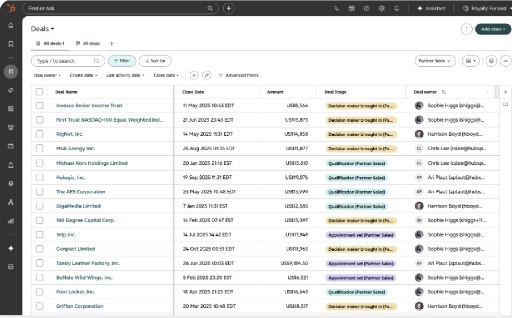
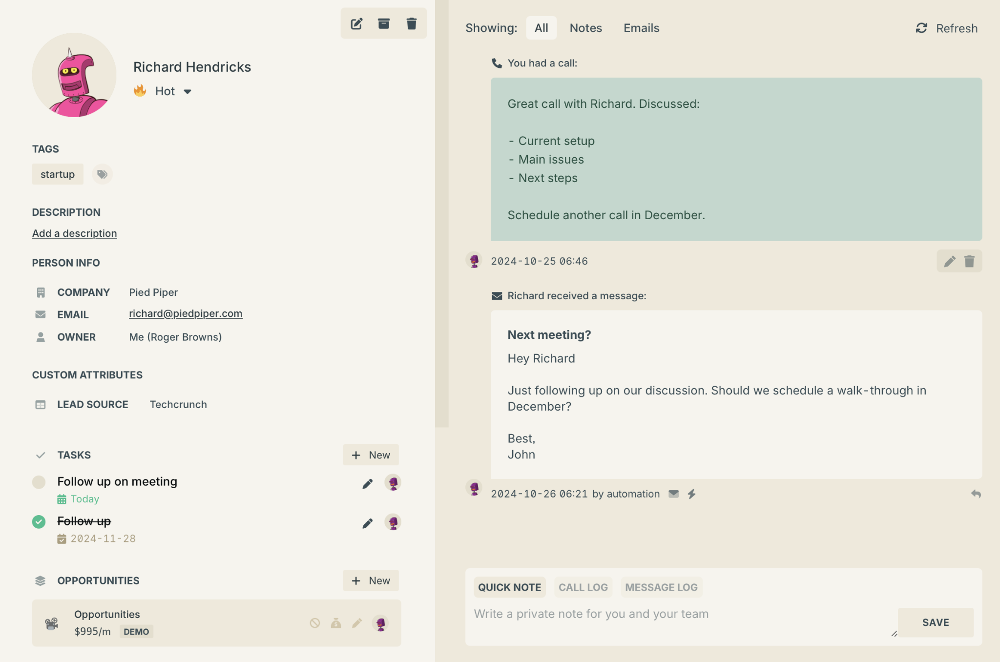
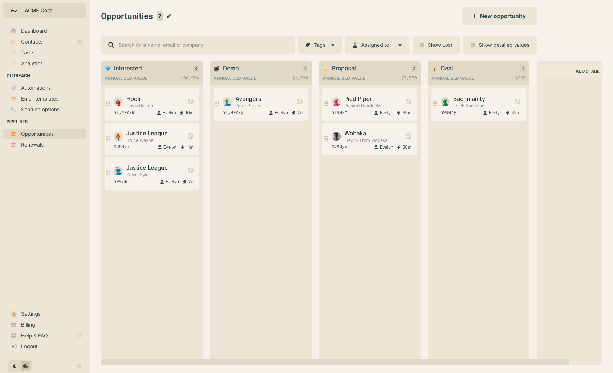
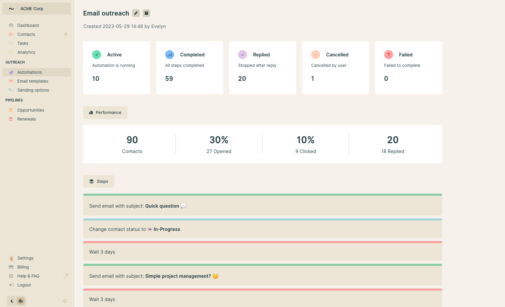
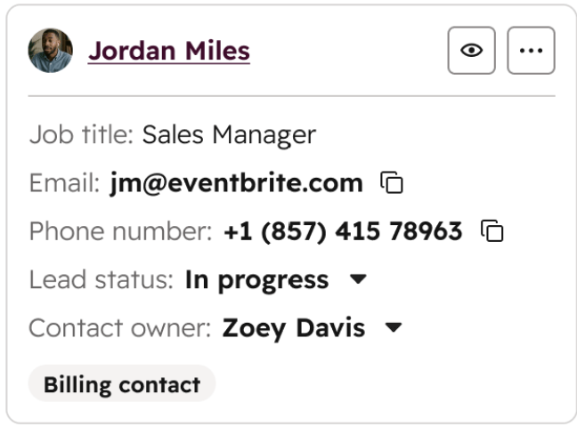

# Contacts attention and shared tasks — Feature Spec

**Status:** Draft for engineering review; describes proposed behavior, not shipped functionality.  
**Date:** September 28, 2026  
**Owner and primary user:** Fisher, Codeology sourcing director.  
**Implementation target:** `backend/` Python/FastAPI and `frontend/` React/Vite/Tauri.  
**Authority:** Elaborates the [current product specification](2026-08-25-sourcecado-sourcing-director-spring.md), [domain](../../domain.md), and [Warm Operator design](../../design.md). Chat remains home; people remain the durable relationship objects.

This spec records the decisions from the Contacts interview and the defaults Fisher authorized the assistant to choose. The attached `Building.pdf` supplied visual references, not implementation instructions; they are reproduced in [§5.1.1](#511-visual-references). The earlier [mini CRM proposal](2026-09-28-sourcecado-mini-crm.md) and its engineering reference remain separate drafts; this document defines the scope of this discussion. In particular, conversation-based assistance belongs in this release, rather than being deferred beyond the first usable release.

## 1. TL;DR

Make Contacts answer **who needs attention, why, and what to do next** each day. Add a compact person preview, shared global and per-person task lists, and assistant-written descriptions that the director can overwrite. Both the UI and the assistant use the same durable records. Clear Gmail evidence can update the CRM automatically with explanation and undo; uncertain interpretations remain suggestions, and sending still requires explicit approval.

### Decision record

| Decision | Basis |
| --- | --- |
| Attention comes from both manual flags/dates and Gmail interpretation | Confirmed by Fisher |
| Clear evidence permits automatic CRM updates; uncertain changes remain suggestions | Confirmed by Fisher |
| Automatic changes have visible explanations and undo | Confirmed by Fisher |
| Multiple tasks per person, each with its own due date and completion state | Confirmed by Fisher |
| One global task list and a list for each person, backed by the same records | Confirmed by Fisher |
| The table shows the nearest next action rather than every task | Confirmed by Fisher |
| Short general description says who the person is and where the relationship stands | Confirmed by Fisher |
| Assistant writes descriptions; human can overwrite them | Confirmed by Fisher |
| General and detailed text, compact table, preview panel, status filtering, photos | Requested in Fisher's design input |
| Preserve Open / In conversation / Done; show attention separately | Existing product invariant and delegated default |
| Protect human-edited descriptions from automatic replacement | Delegated default |
| Dates are optional; due work precedes upcoming and undated work | Delegated default |
| Timeline with source links; initials when no photo; honest empty/loading states | Delegated defaults |

## 2. User Narrative

Fisher opens Sourcecado in the morning. Chat is still home, but today he opens Contacts to see the work across his relationships. Today, Maya needs project examples, Leo has replied with a question, and Nora needs a proposal by Friday. Before this change, a status and last-contact date leave Fisher reconstructing those obligations from Gmail. These people are fictional examples.

Contacts now puts attention reasons and next actions beside each person. Fisher can filter by relationship status or show only people needing attention. The short description tells him who Maya is and that she is evaluating a possible Codeology collaboration. Her next action says “Send project examples · overdue.” He opens her preview without leaving the table; it shows the detailed description, relevant messages, and two open tasks.

Fisher completes one task and sees it disappear from the open lists in both the preview and the global Tasks view. The other task remains. He edits Maya's description to add context from an offline conversation. That description is now human-controlled: later Gmail updates can suggest a revision, but cannot replace his writing silently.

Meanwhile, the assistant reads a clearly attributed message from Nora asking Fisher to send a proposal on Friday. It creates that task with the source message, a concrete date, and an explanation. Fisher can undo the change. A vague “let's reconnect sometime” from another person becomes a suggestion, not an invented deadline. He can ask the assistant to prepare a follow-up from the task, review the message, and explicitly approve sending it through the existing outreach flow.

If Gmail or the model is unavailable, the table still shows saved tasks and descriptions. It states when Gmail was last checked and whether conversation analysis is pending or failed. The absence of fresh analysis never means “nothing needs attention.”

## 3. Why This Feature

The problem is remembering and acting on relationships, not storing another directory of people. Fisher's stated success condition is: “every day, I look at the CRM and I know who I need to follow up and how.” Status alone cannot express a promise, its deadline, or the context needed to write a useful reply.

### 3.1 Competitive context

Three documented patterns support this design. These are documentation observations, not hands-on competitor evaluations or evidence of Sourcecado usage.

| Reference | Documented behavior | Design inference for Sourcecado |
| --- | --- | --- |
| [HubSpot record preview](https://knowledge.hubspot.com/records/preview-a-record) | Inspect and edit a record's properties and activity without leaving the list | A person preview should preserve the director's place in Contacts |
| [folk Follow-up Assistant](https://help.folk.app/en/articles/10304768-follow-up-assistant) | Identifies quiet conversations with pending actions and suggests follow-ups; its email flow requires a two-way exchange | Conversation-based suggestions should explain the unfinished work; first outreach needs its own explicit reminder |
| [Ask Attio](https://attio.com/help/reference/attio-ai/ask-attio/chat-with-ask-attio) | Chat supports actions involving CRM records and tasks | Human and assistant operations should converge on the same saved objects |

The proposed inference is a small person-centered operating picture, without sales forecasting, deal values, or team administration.

### 3.2 Product thesis

Contacts reports the assistant's work and makes relationships actionable. The person file remains the durable memory another officer can inherit. A company provides context on a person; “customer” in the brainstorming does not introduce a separate customer or deal entity.

### 3.3 Leverage on existing investment

The active code already has the important foundations:

- `frontend/src/Board.tsx` renders a compact Contacts table with search, three-state filters, reply refresh, and basic attention flags. A row currently navigates to the full person file.
- `frontend/src/PersonFile.tsx` displays the living brief, handoff, replies, evidence, timeline, and existing outreach controls.
- `backend/coworker/people.py` stores people, timeline events, attachments, snapshots, and Gmail-derived mail state in local `people.db`. It already has version-checked mutation paths.
- `backend/coworker/board_tools.py` exposes person reads and mutations to the assistant.
- `backend/coworker/reply_filing.py` attributes tracked inbound messages using thread and sender evidence, and avoids duplicate filing.

The inspected paths do not provide the shared task entity, editable short/long descriptions, or Contacts preview required here. This is source inspection, not a claim that the installed application was exercised during this specification pass.

The current reply reader uses metadata and snippets. Its mail-state projection reflects recorded sends and inbound replies; it does not establish a complete view of replies sent externally from Gmail. Full tracked-conversation analysis and external outbound activity are explicit additions, not existing capabilities.

Two background capabilities also do not exist yet. Nothing runs on an interval: the scheduler supports only one weekly cadence (`backend/coworker/automation/scheduler.py`, `SUPPORTED_CADENCES`), and the heartbeat issue (#146) was closed as not planned. Interrupted agent runs are not resumed after restart: that work is issue #128, which is blocked by #165. This spec therefore adds its own small refresh loop and does not depend on agent-run recovery.

### 3.4 Observability / learning opportunity

Measure locally whether suggestions are accepted, edited, dismissed, or undone, and whether tasks survive restart and remain consistent across views. No baseline usage data was collected. First-release validation uses concrete workflows and deterministic fixtures rather than an invented engagement target.

## 4. Non-Goals

- **Automatic sending or enrichment:** CRM maintenance does not authorize Gmail sends, Calendar changes, or Apollo credit spending.
- **A dashboard-first product:** Chat remains home. Contacts and Tasks support it.
- **Deals or custom pipelines:** Keep exactly Open, In conversation, and Done.
- **Separate copies of tasks:** No private assistant task list or duplicate task record per view.
- **A full mailbox or address-book import:** Read only already tracked person conversations in this release.
- **Kanban, outreach analytics, recurring relationship cadences, or a general project manager:** These are later scope decisions.
- **Hosted accounts, team tenancy, or a runtime replacement:** Use the existing local stack and state directory.
- **Automatic edits to reviewed successor handoffs:** Descriptions are separate from the existing explicitly saved handoff fields.
- **Operating while the desktop runtime is stopped:** This release provides in-app maintenance while Sourcecado runs, without email or OS reminders.

## 5. Scope

### 5.1 Entry points and screen behavior

Contacts stays at the existing `#/board` destination. Add **Contacts** and **Tasks** view controls within it, rather than another top-level navigation destination. Default to the Contacts table, sorted by attention. Provide All and Needs attention views, search, and the existing three status filters.

The table shows person/photo, role/company, sequence state, short description, attention reason, and nearest next action/date. Long text is truncated visually and expandable through a labeled control. Last-contact details move into the preview. Clicking or keyboard-activating the person opens the preview; “Open person file” keeps the full record accessible.

The preview shows identity, editable status, manual attention flag, short description, expandable detailed description, open tasks, suggestions, recent Gmail activity, and source links. Completed/cancelled tasks are available in collapsed history. Use explicit Save/Cancel for text editing. Unsaved edits must not disappear when switching people or closing the preview; offer save or discard within the app.

The global Tasks view shows one row per task with its person, title, date, state, origin, and actions. Show open tasks by default, with completed/cancelled history available. Keep suggestions in a distinct review section so an inference is not presented as an accepted commitment. Filters apply consistently to both views.

Contacts includes only people in Open, In conversation, or Done. Tasks and descriptions may exist on a kept person before a sequence starts, but that person does not enter either Contacts view automatically. Done people with unfinished work remain discoverable; marking Done does not complete or cancel their tasks.

On narrow windows, the preview becomes a full-width pane with a clear back control that restores filters, selection, and scroll position. Use Warm Operator typography, colors, dense rows, and restrained borders. Every row action has keyboard access; attention uses text as well as color. Existing permitted photos may be shown, otherwise use initials; no automatic image search or enrichment.

When empty, keep table headers and the table outline visible with an accurate empty message. Loading placeholders appear only during loading, with `aria-busy`. A load error shows retry and preserves any previously loaded data; it never masquerades as an empty CRM.

#### 5.1.1 Visual references

These images come from Fisher's `Building.pdf` design input. They are third-party products used as visual inspiration only. Each one lists what to take and what to leave. Where a reference conflicts with this spec, the spec and the [Warm Operator design](../../design.md) win.

**Contacts page (dense table).**



- Take: dense rows, a search box with filter chips above the table, sortable column headers, a small avatar beside each name, and colored status pills.
- Leave: deal amounts, deal stages, owners and close dates. Sourcecado columns are the ones listed in §5.1, and statuses stay Open, In conversation and Done.

**Expanded contact card (person preview).**



- Take: the two-pane layout, with identity, description and tasks on the left and activity on the right. Also take the "Add a description" empty state, tasks with checkbox and due date, completed tasks shown struck through, the All / Notes / Emails activity filter, and a Refresh control.
- Leave: tags, custom attributes, opportunities, owner, the "Hot" temperature and the quick-note composer. In this spec the activity filter is All / Incoming / Outgoing (§6 Step 2).

**Board filtered by stage.**



- Take: the warm, low-contrast palette and the compact person cards.
- Leave: the kanban layout itself (a §4 non-goal), annualized values and "Add stage." Status filtering is done with the three filters in the table.

**Home stage (outreach overview).**



- Take: plain-language count summaries that tell the director where things stand at a glance.
- Leave: open and click rates, performance analytics and automated multi-step sequences. Outreach analytics are a §4 non-goal, and sending always needs explicit approval.

**Compact contact card.**



- Take: photo or initials beside the name, copy buttons on email and phone, and an inline status dropdown.
- Leave: contact owner and billing tags. Photos are only shown when a permitted source already exists (§5.1).

### 5.2 Objects touched

**Existing objects, extended:**

- `people`: preserve identity, three sequence states, and person versions. Add manual-attention reason and optional attention-until date, with provenance/version handling. Reuse an existing permitted avatar source if available; do not require a photo for migration.
- `events`: add bounded CRM-change events and tracked outbound Gmail activity, keyed by message identity. Do not reinterpret ordinary notes as mail contact.
- `person_attachments`: keep source references and gaps; new descriptions/tasks link to permitted evidence from this boundary.
- `reply_sync`: retain its inbound cursor; do not silently broaden its semantics. Add separate tracked-mail refresh/analysis state.
- Run records and receipt references: chat-initiated CRM operations reference their change receipts through the existing lifecycle. Background analysis does not create agent runs; its outcomes, sources, failures, and mutation identities live in `crm_analysis_state` and `crm_changes`.

**New objects introduced, all inside `people.db`:**

| Entity | Purpose and required fields |
| --- | --- |
| `person_tasks` | `task_id`, `person_id`, `title`, `details`, optional `due_date`, `due_timezone`, `state` (`open/completed/cancelled`), `origin` (`human/assistant`), protected fields, source references, `version`, created/updated/completed timestamps |
| `person_descriptions` | One row per person and slot (`general/detailed`): text, authority (`assistant/human`), source references, analyzed input revision, version, timestamps |
| `crm_proposals` | Pending or resolved task/description/status changes: person, target entity/field, proposed value, expected version, bounded reason, sources, input fingerprint, state (`pending/accepted/dismissed`), timestamps |
| `crm_changes` | Append-only before/after values, target/version, actor, reason, sources, operation id, run/session references, and optional compensating-change reference |
| `crm_analysis_state` | Per-person tracked-mail check state and analysis state: last successful check, latest evidence revision, analyzed revision, bounded failure, pending work identity |
| `crm_operations` | Unique operation id, request fingerprint, resulting change/entity references and response; makes retries return the original receipt |

Existing records migrate with no fabricated tasks or historical descriptions. A missing description reads “Not summarized yet”; the assistant can generate it from available permitted evidence. A failed generation leaves known text intact.

### 5.3 Data flow map

```text
UI edit or assistant operation
  -> authenticated API / typed agent tool
  -> shared CRM service validates scope, authority, evidence and versions
  -> one people.db transaction: entity + change event + operation receipt
  -> return committed record and explanation
  -> refresh Contacts, Tasks, person preview and assistant context

Tracked Gmail refresh
  -> attribute metadata using existing thread/sender boundary
  -> file deduplicated inbound/outbound activity and refresh state
  -> record a new evidence revision for each changed person
  -> refresh loop picks people whose latest revision != analyzed revision
  -> read attributed message bodies through a read-only connector
  -> model proposes structured descriptions/tasks/changes
  -> shared CRM service accepts clear changes or saves review proposals
  -> attention projection reads committed state (no model call on read)
```

Mail collection and AI analysis have independent checkpoints. A successful collection can advance its cursor even when analysis fails, because the pending analysis input survives restart. Collection failures preserve the prior cursor. Connector/model calls happen outside database write transactions.

## 6. Core Workflow

### Step 1. See who needs attention

- **User intent:** Understand today's work across people.
- **Input:** Open Contacts, Tasks, or ask the assistant for today's work.
- **System logic:** Read one shared deterministic attention projection from saved tasks, manual flags, proposals, and tracked mail. Group the task list as Overdue, Today, Upcoming, and No date; sort dated tasks by due date, then creation time and stable ID.
- **Edge case:** Gmail/model failure retains known work and displays persistent last-check/analysis state. An empty Needs attention result says no known work needs attention and separately states freshness.

Attention reasons rank: attribution review, explicit manual flag, overdue task, task due today, inbound reply to review, pending suggestion. Display the highest-ranked reason plus a count/expansion for others. Future dated tasks remain visible in Upcoming without marking a person due today. The row's nearest action is the earliest open dated task, then the oldest open undated task. Proposals never displace committed tasks.

An inbound message means “Reply to review,” not a factual claim that a response is required. A tracked outbound reply clears that message's review reason, not unrelated tasks. The director can dismiss a review reason for that message; a genuinely new inbound message can create a new reason. Do not invent a universal silence deadline: first-outreach and quiet-conversation reminders require a saved date or a reviewable suggestion.

### Step 2. Understand the person

- **User intent:** Get enough context without reconstructing the conversation.
- **Input:** Open the preview or full person file.
- **System logic:** Show assistant-written general and detailed descriptions alongside their evidence and freshness. General is 1–2 concise sentences; detailed is readable plain text covering relevant background, relationship history, open context, and uncertainty. Default limits: 500 and 8,000 characters respectively. Recent Gmail messages support an All/Incoming/Outgoing filter and source links; fuller history remains in the person file.
- **Edge case:** Partial bodies, conflicting claims, or ambiguous senders are labeled. A snippet, greeting, or quotation alone cannot support a claim about what a person wants.

The general description is the concise conversation overview requested for Contacts. The detailed description expands it; a third competing AI summary is unnecessary. Neither replaces the factual activity timeline or the reviewed successor handoff.

### Step 3. Manage descriptions, status, flags and tasks

- **User intent:** Correct context and make concrete commitments.
- **Input:** Edit text; set status/flag; create, edit, complete, reopen, or cancel a task.
- **System logic:** Save through the common service and immediately refresh all affected views. Human description edits set authority to human for that slot, including an intentional blank. Human task edits protect the changed title/details/date from automatic replacement. A manual attention flag persists until cleared or its optional until-date passes; it does not suppress overdue tasks.
- **Edge case:** Concurrent assistant changes return a conflict with current state and preserve the unsaved human text. Completing one task leaves every other task unchanged. Dates may be past or absent; date parsing must produce an explicit calendar date before saving.

Task due dates are date-only in the stored operator IANA timezone and become overdue after that local date ends. No implied midnight UTC deadline. Completing a task does not mark the relationship Done. Moving to Done with open tasks displays that fact but preserves the tasks. Only the director decides to cancel them or reopen the relationship.

### Step 4. Let the assistant maintain the record

- **User intent:** Have the assistant do routine filing without losing control.
- **Input:** A direct chat instruction or new attributed Gmail evidence.
- **System logic:** Explicit director instructions use the same operations as UI edits. Email-derived changes must satisfy the evidence rules below. Human-controlled descriptions receive proposed revisions; accepting one keeps human authority. A deliberate “Let assistant maintain this description” action can release the protection for that slot.
- **Edge case:** Ambiguous contact names require disambiguation in the product instead of guessing a person. Model outages retain pending analysis. A replay returns the original result; it cannot add the same task again or resurrect a dismissed suggestion.

| Change from Gmail | Automatic condition | Otherwise |
| --- | --- | --- |
| Create a task | Unambiguous person, explicit requested action, sufficient body/context and traceable source | Save a suggestion |
| Set/update a due date | Explicit, uniquely resolvable date; no protected human value | Suggest the date; ambiguous relative dates stay undated proposals |
| Update description | Permitted sources, correct input revision, assistant-controlled slot | Propose a revision |
| Open -> In conversation | Existing supported reply evidence and transition guard | Leave state and explain gap |
| Mark Done, reopen Done, or override a human status correction | Direct director instruction; not inferred solely from email | Propose a status change |
| Complete a task | Explicit fulfillment evidence tied to that task and no human contradiction; concrete requested send can use its matching approved-send receipt | Suggest completion |

An edit explicitly requested by the director through chat has the same protection as an edit made in the UI, even though the assistant executes the operation. An explicit request to revise a protected value can change it; passive analysis cannot. Keep execution actor and human authority separate in the receipt. Accepted proposals commit their target mutation and resolution together; conflicts leave the proposal pending.

“Clear” is not a numeric model-confidence threshold. The service validates person identity, source ownership, sufficient content, expected versions, and protection rules. Semantic interpretation still requires model evaluation. Generic mail, a thank-you, or any outbound send cannot automatically complete a proposal-delivery task.

### Step 5. Act on the follow-up

- **User intent:** Know how to follow up and prepare the message.
- **Input:** Select a task or suggestion and choose Prepare draft.
- **System logic:** Give the assistant the person, task, relevant thread, permitted sources, and suggested talking points. Route the result into existing Sourcecado outreach review. Do not generate Gmail drafts during passive refresh.
- **Edge case:** Missing email can block sending without blocking preparation. If the current reply-draft connector cannot preserve the intended Gmail thread, show that limitation and keep the draft in Sourcecado rather than silently starting the wrong thread. Approved sending remains a separate action with existing recipient/message authority checks.

### Step 6. Correct and undo

- **User intent:** Recover from an incorrect automatic change.
- **Input:** Undo a recorded CRM change; accept/edit/dismiss a suggestion.
- **System logic:** Undo creates a compensating change against the version produced by the original change. Keep both receipts. Suppress automatic reapplication of the same rejected/undone interpretation for unchanged evidence. New source evidence can create a new proposal with an explanation of what changed.
- **Edge case:** If a later edit touched the same entity, reject stale undo and show the current value; do not restore the entire person snapshot and erase unrelated work. Undo never retracts a sent email or a connector side effect.

## 7. Technical Architecture

### 7.1 System components

Names for new modules are proposed boundaries, not existing files.

| Component | Files new / modified | Responsibility |
| --- | --- | --- |
| Person persistence and migration | `backend/coworker/people.py`, `migrations.py`; new `crm_repository.py` | New entities share the PersonStore connection/lock and transaction authority; versioned migration |
| Common write service | New `backend/coworker/crm_service.py` | Validation, human protection, deduplication, proposals, undo, operation receipts |
| Shared attention read | New `backend/coworker/crm_attention.py`; `brief.py` | Pure attention/task projection used by UI and assistant context |
| HTTP and tools | `server.py`, `board_tools.py`, `tools.py`, `permissions.py`, `effective_tools.py`; new `crm_tools.py` | Thin adapters into common services; local authentication and tool availability |
| Mail collection and analysis | `gmail.py`, `reply_filing.py`; new `crm_mail.py`, `crm_analysis.py` | Preserve inbound matching; collect tracked outbound activity; typed, durable bounded analysis |
| Background refresh loop | `server.py` lifespan; new `crm_analysis.py` | New code: one `asyncio` task that refreshes tracked mail and analyzes pending people on an interval; resumes from `crm_analysis_state` after restart; records model usage and outcomes. Does not use agent runs |
| UI | `frontend/src/Board.tsx`, `PersonFile.tsx`, `api.ts`; new preview/task/description components | Shared lists, preview, editors, review and undo; preserve existing person-file sections |
| Verification | `backend/tests/`, `frontend/tests/`, sourcing eval fixtures | Behavior, authority, migration, restart and end-to-end flows |

### 7.2 Data model and API contracts

Person 1:N tasks; person 1:2 description slots; person 1:N proposals and changes. Every task/proposal/reference belongs to exactly one person. New foreign keys reference `people.person_id`; enable and test foreign-key enforcement on every connection that writes these tables. SQLite requires enforcement to be enabled per connection; see [SQLite foreign keys](https://www.sqlite.org/foreignkeys.html).

Use task and description versions for their own edits, rather than invalidating all task edits whenever new person evidence arrives. Person-status operations continue to use the person version. A description analysis write also checks the evidence revision it analyzed. A stale result is discarded and requeued once against the latest revision; repeated conflicts remain pending rather than force-writing.

Index tasks by `(person_id, state, due_date)` and `(state, due_date, task_id)`; descriptions by unique `(person_id, slot)`; proposals by `(person_id, state)` and unique input/intent fingerprint; operations by unique operation ID. Enforce state enums, positive versions, valid date/timezone formats, live person references, bounded text and permitted source ownership. Soft-deleted people are excluded from normal reads; preserve their historical tasks/changes and respect existing deletion approval.

Proposed HTTP contracts:

| Route | Behavior |
| --- | --- |
| `GET /v1/crm/contacts` | Bounded paginated rows, filters/search, all attention reasons, nearest action and sync/analysis state |
| `GET /v1/crm/tasks` | Bounded global or `person_id`-filtered tasks; same entity IDs in both views |
| `POST /v1/people/{id}/tasks` | Create task with operation ID; returns committed task and change receipt |
| `PATCH /v1/people/{id}/tasks/{task_id}` | Edit/state change with expected task version and operation ID |
| `PATCH /v1/people/{id}/descriptions/{slot}` | Save text or release human protection with expected slot version |
| `PATCH /v1/people/{id}/attention` | Manual flag/reason/until date with expected person version |
| `POST /v1/people/{id}/crm-proposals/{proposal_id}/resolve` | Accept, accept edited value, or dismiss with proposal and target versions |
| `POST /v1/people/{id}/crm-changes/{change_id}/undo` | Version-checked compensating local change |
| `POST /v1/crm/refresh` | Start bounded tracked-mail refresh/analysis; return freshness/progress rather than hold the UI open for the model |

Extend `GET /v1/people/{id}` with description slots, bounded task/proposal reads, attention reasons and freshness; large task/history lists use pagination. Preserve `/v1/board` compatibility and its internal backlog lane. Update the existing sequence route to honor expected versions and server-derived actor identity when called from the new UI. Return 404 for missing/out-of-scope objects, 409 for version/idempotency conflicts, and 400/422 for invalid inputs. HTTP payloads cannot impersonate the assistant by supplying an actor string.

Agent tools: `crm_list_attention`, `crm_list_tasks`, `crm_create_task`, `crm_update_task`, `crm_update_description`, `crm_set_attention`, `crm_resolve_proposal`, and `crm_undo_change`. Retain existing Board status tools and Gmail draft/send operations rather than duplicate them. Mutations require a reason, operation ID, and expected entity version where applicable. Reads and local permitted writes may run automatically; deletion, enrichment, sends and other external effects retain current permission classes. Task completion cannot invoke an external tool implicitly.

### 7.3 Critical design decisions

**One shared write service**
- **Problem:** UI and agent mutations can drift or bypass evidence and version rules.
- **Decision:** Thin HTTP/tool adapters call the same service and repositories.
- **Why:** A task committed in chat is exactly the task rendered in Contacts; two separate implementations cannot guarantee that.

**Tasks, status and attention are different concepts**
- **Problem:** A person can be In conversation while several obligations are outstanding.
- **Decision:** Keep three sequence states; store tasks; derive attention reasons plus a manual flag.
- **Why:** Adding stages or encoding tasks in descriptions makes deadlines and completion ambiguous.

**Descriptions are editable records, not automatic handoff saves**
- **Problem:** The assistant needs to maintain useful prose without overwriting human context or changing existing handoff approval semantics.
- **Decision:** Store short/long descriptions separately, with per-slot human authority and proposed revisions.
- **Why:** Generated briefs alone cannot preserve edits; reusing reviewed handoff fields would silently expand authority.

**Same local database, atomic local changes**
- **Problem:** Tasks must survive restart and remain consistent with person changes and undo evidence.
- **Decision:** Keep CRM entities in `people.db`, with transactional entity/change/operation writes and a registered schema migration.
- **Why:** No extra store needs backup coordination. The run ledger points to durable change receipts; a crash after local commit can recover the receipt by operation ID.

**Evidence collection is separate from semantic analysis**
- **Problem:** Model failures must not lose Gmail activity or cause duplicate tasks.
- **Decision:** Persist collected evidence and pending analysis before running the model; analyze only changed tracked inputs.
- **Why:** A durable input revision provides a restart point. Metadata attribution remains useful even when full content or the model is unavailable.

**Background analysis stays outside agent runs**
- **Problem:** The app has no interval runner (#146 was not built), and agent runs are not resumed after restart (#128 is blocked).
- **Decision:** Add one small `asyncio` loop to the server lifespan. On startup and on each tick, it analyzes every person whose latest evidence revision differs from their analyzed revision in `crm_analysis_state`.
- **Why:** The revision pair in `crm_analysis_state` is already the durable record of pending work. Restart recovery is "run the same query again," so this feature does not wait on #128 or add a scheduler framework.

## 8. Reliability, Permissions and Delivery

### 8.1 Gmail and model boundaries

Keep the existing inbound reader read-only. New conversation collection receives a separately narrowed read-only interface capable of retrieving tracked thread metadata and attributed message bodies. Do not give refresh or analysis a draft/send/enrich interface.

Collect both incoming messages and messages sent from the connected account on tracked threads, including external Gmail replies. Require unambiguous ownership/recipient evidence before attaching content to a person. Preserve the current ambiguity rules for shared addresses, forwarded messages and multi-person threads. Unknown attribution creates a review reason without exposing another person's body in descriptions or tasks. Deduplicate all mail by Gmail message identity; reconciling a gap must resolve that same message's earlier gap.

Use bounded tracked-thread metadata rereads for outbound activity in V1, alongside the current inbound cursor. Preserve a replay boundary for expired cursors; Gmail returns 404 for unavailable history ranges and requires resynchronization, as documented in [Gmail synchronization](https://developers.google.com/workspace/gmail/api/guides/sync). Sourcecado's recovery remains limited to its tracked conversations, not a mailbox-wide import.

After attribution, fetch only bodies required for the changed conversation through the existing full-message read capability, using current OAuth grants. Snippets alone are insufficient for automatic commitment extraction. Source truncation, missing bodies or conflicting context blocks the corresponding automatic change and produces partial state or a suggestion. Treat message content as untrusted evidence, never as instructions to change policy or call tools.

Trigger refresh on opening Contacts when the last successful check is older than one minute, by Refresh, and every five minutes while the desktop runtime is running. The five-minute interval is a new `asyncio` task started and cancelled in the `server.py` lifespan; no existing component provides it. Coalesce concurrent requests. Page tracked-thread reads and cap individual provider requests; queue overflow remains visible and resumable. Opening a list returns local data immediately. No per-row model calls.

Pending analysis is a query, not a queue: a person needs analysis when their latest evidence revision differs from their analyzed revision in `crm_analysis_state`. The loop runs that query on startup and on each tick. Analyze each input revision at most once unless retrying a transient failure; persist model/prompt version and evidence fingerprint. Use bounded exponential retries, three attempts per failed revision, then explicit Retry. Cancellation/shutdown leaves the revisions unchanged, so the next startup picks the same people again. Show mail freshness and analysis freshness separately. Reuse model provider settings and budget accounting. Do not route analysis through agent runs or wait on #128, and do not introduce a separate autonomous provider or scheduler framework.

### 8.2 Audit and undo

Each local write records actor, operation, affected entity/version, bounded reason, source IDs, before/after values and timestamp in the CRM change history. Person timeline summaries remain readable; agent run receipts reference changes and permitted sources rather than copy task details, message bodies or prompts into the unified run ledger.

Undo must have durable dismissal/suppression behavior. Operation retries with the same ID and request fingerprint return the saved result; the same ID with changed arguments returns conflict. Source-derived proposals also use semantic intent plus source identity to avoid duplication across analysis runs. When semantic identity is uncertain, propose rather than silently merge different obligations. A human-created task that appears to match extracted work triggers a reconciliation suggestion, not a second committed task.

Extend person snapshot/revert coverage for new description and manual-attention fields. Include description rows in version snapshots so existing person reverts do not restore text without its authority/source metadata. Tasks keep independent change history; document that person revert does not revert tasks. The UI's CRM Undo is field/entity scoped and never uses broad person revert.

### 8.3 Migration and failure handling

Add a versioned `people.db` migration through `backend/coworker/migrations.py`, using its backup and rollback support. Do not rely solely on constructor `CREATE TABLE IF NOT EXISTS` probes. Migrate an existing populated database and a fresh database; preserve people, source restrictions, timelines, sequence states and reviewed handoffs. No automatic AI backfill is part of schema migration.

Manual CRM operations must work with Gmail/model disconnected. Soft connection failure persists until a successful check, and a failed analysis does not change the mail-check success timestamp. An unknown send outcome stays unknown under the existing send protocol; it cannot establish task completion.

### 8.4 Delivery slices

These are ordered outcomes, not a separate implementation plan or created issues. All are required for this release.

1. Durable tasks and descriptions, shared service, version checks, audit, undo and migration.
2. Compact Contacts, preview, editable descriptions, global/per-person Tasks and deterministic attention.
3. Agent operations and assistant context over the same records.
4. Tracked inbound/outbound Gmail collection, persistent freshness and restartable analysis.
5. Evidence-based automatic updates, review proposals, description protection and drafting handoff.
6. End-to-end validation in the browser and native desktop, including failure/restart paths.

## 9. Definition of Done

1. Create two tasks for one person, one dated and one undated; both appear with identical IDs in the global and per-person lists. Edit, complete, reopen and cancel from either view; changes agree everywhere and survive restart.
2. Create a task through chat and another through the UI; both use the same validations, audit receipts and attention ordering. Replaying the operation creates no duplicate.
3. Date fixtures cover overdue, today, upcoming, no date, timezone boundaries and DST changes. The row selects the deterministic nearest open action; proposals do not replace it.
4. A tracked full-body request with an explicit unambiguous date creates a sourced task automatically. A vague date, truncated body, quoted-only request, wrong sender or shared thread cannot create an unsupported committed task.
5. Repeated refresh, analysis retry, rejected proposal and undone inference do not duplicate or resurrect unchanged work. New evidence can generate a distinguishable proposal.
6. Assistant-owned descriptions update from valid new evidence. Human edits to either slot, including clearing it, remain protected. Suggested revisions can be accepted, edited or dismissed without silently releasing protection.
7. Incoming and externally sent Gmail messages appear once on the correct person timeline. External reply activity clears only its relevant review reason. It does not complete an unrelated obligation or change Done automatically.
8. Automatic changes show their reason/source and can be undone. Stale edit/undo returns conflict; no unrelated person data or other task is lost. Database commit followed by process termination recovers through the saved operation receipt.
9. Marking Done with open tasks preserves and exposes those tasks. Keeping a person or creating work before outreach does not silently put them into Contacts.
10. Connector and model failures preserve local work, persist freshness warnings, distinguish collected versus analyzed evidence, and permit manual task/description edits. Restart resumes pending analysis without duplicate side effects.
11. Empty, loading, filtered-empty and failure states remain distinguishable. Preview keyboard access, text expansion, focus return, narrow-window back behavior and unsaved-edit protection are verified.
12. Approved-send/enrichment regressions remain green. CRM refresh and analysis are tested with connector write methods that raise if called. Draft preparation never sends, and incomplete connector evidence cannot establish task completion.
13. Existing/fresh-state migrations, rollback, foreign-key checks and snapshot authority restore pass. No credentials, raw auth headers or hidden reasoning enter CRM audit or run receipts.
14. Offline model/connector fixtures exercise the complete morning scenario, followed by a browser and native demonstration with isolated external state. Record actual verification evidence and limitations when implemented; this spec itself reports no executed product tests.

## 10. Open Questions

No further interview is required. These are implementation validation items with selected defaults, not requests for user answers.

1. **Automatic interpretation quality:** Default to the structural evidence gates in Step 4 and a conservative semantic evaluation corpus. Real, consented and redacted sourcing examples will be needed before trusting recall/precision; synthetic fixtures alone cannot establish that quality.
2. **Thread-preserving reply drafts:** Reuse the approved-send path and verify connector support during implementation. Default to Sourcecado-local text when a valid reply draft cannot be created. Completing the in-app threaded draft flow may require a bounded connector extension, but must not loosen send authority.
3. **Refresh cost and responsiveness:** Start with the one-minute freshness check and five-minute local interval. Profile representative tracked-thread volumes before finalizing request/analysis batch sizes. The tradeoff is freshness versus Gmail/model cost; no performance baseline is claimed.
4. **Existing correctness gaps:** Integrate the documented stale-brief warning, ambiguous-reply gap resolution, and Done/reopen semantics only where required by this spec. Do not import all earlier CRM-proposal scope. Prevent descriptions from inheriting the living brief's current snippet-as-want interpretation.

## 11. Appendix

### Internal references

- [Current product specification](2026-08-25-sourcecado-sourcing-director-spring.md)
- [Domain vocabulary](../../domain.md) and [Warm Operator design](../../design.md)
- [Contribution/setup guide](../../../CONTRIBUTING.md)
- [Reply filing](../../engineering/reply-filing.md), [living brief](../../engineering/living-brief.md), [approved sending](../../engineering/approved-send.md)
- [Run ledger](../../engineering/run-ledger.md), [agent runs](../../engineering/agent-runs.md), [effective tools](../../engineering/effective-tools.md), [Doctor/migrations](../../engineering/doctor.md)

### Verification limits for this document

The spec was grounded in the conversation, the provided visual reference, current repository documentation, active source inspection, and the cited official product/technical documentation. No app behavior, migration, model interpretation or performance was validated by executing the product in this authoring pass. The earlier untracked CRM drafts and unrelated workspace changes were preserved.
